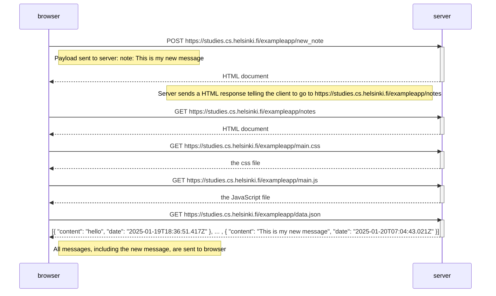

```mermaid
sequenceDiagram
    participant browser
    participant server

    browser->>server: POST https://studies.cs.helsinki.fi/exampleapp/new_note
    activate server

    Note right of browser: Payload sent to server: note: This is my new message

    server-->>browser: HTML document
    deactivate server

    Note left of server: Server sends a HTML response telling the client to go to https://studies.cs.helsinki.fi/exampleapp/notes
    
    browser->>server: GET https://studies.cs.helsinki.fi/exampleapp/notes
    activate server
    server-->>browser: HTML document
    deactivate server
    
    browser->>server: GET https://studies.cs.helsinki.fi/exampleapp/main.css
    activate server
    server-->>browser: the css file
    deactivate server
    
    browser->>server: GET https://studies.cs.helsinki.fi/exampleapp/main.js
    activate server
    server-->>browser: the JavaScript file
    deactivate server
    
    browser->>server: GET https://studies.cs.helsinki.fi/exampleapp/data.json
    activate server
    server-->>browser: [{ "content": "hello", "date": "2025-01-19T18:36:51.417Z" }, ... , { "content": "This is my new message", "date": "2025-01-20T07:04:43.021Z" }]
    deactivate server

    Note right of browser: All messages, including the new message, are sent to browser
```
