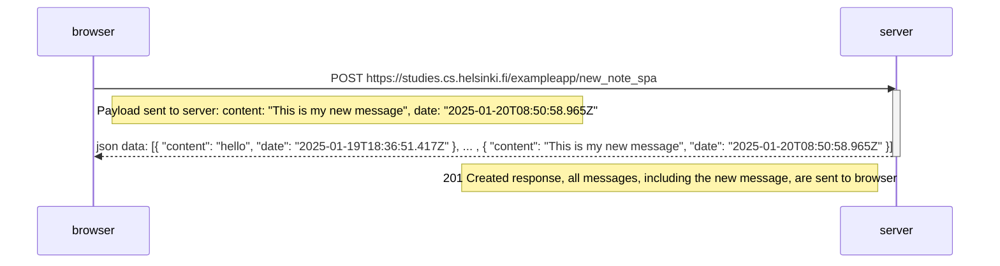

```mermaid
sequenceDiagram
    participant browser
    participant server

    browser->>server: POST https://studies.cs.helsinki.fi/exampleapp/new_note_spa
    activate server

    Note right of browser: Payload sent to server: content: "This is my new message", date: "2025-01-20T08:50:58.965Z"

    server-->>browser: json data: [{ "content": "hello", "date": "2025-01-19T18:36:51.417Z" }, ... , { "content": "This is my new message", "date": "2025-01-20T08:50:58.965Z" }]
    deactivate server

    Note left of server: 201 Created response, all messages, including the new message, are sent to browser
```
